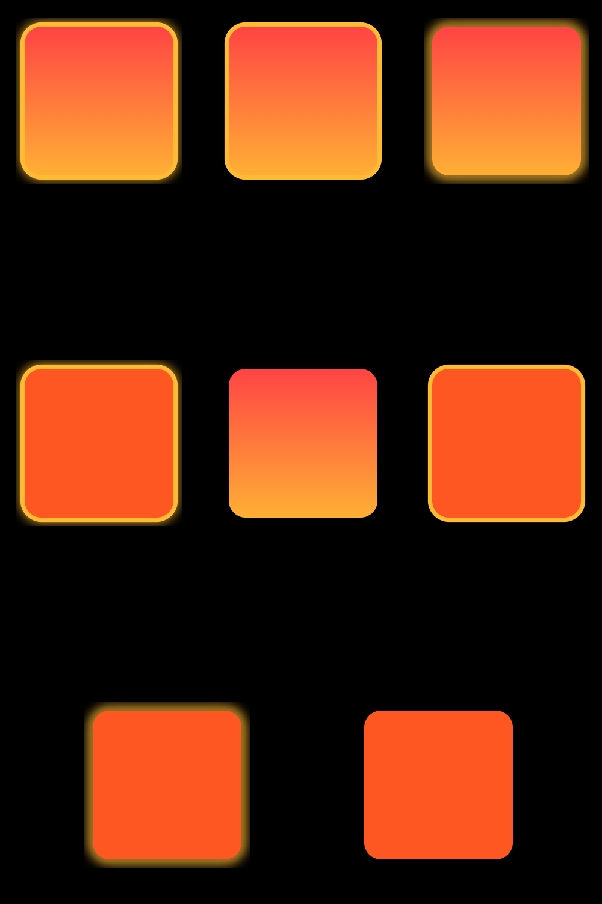
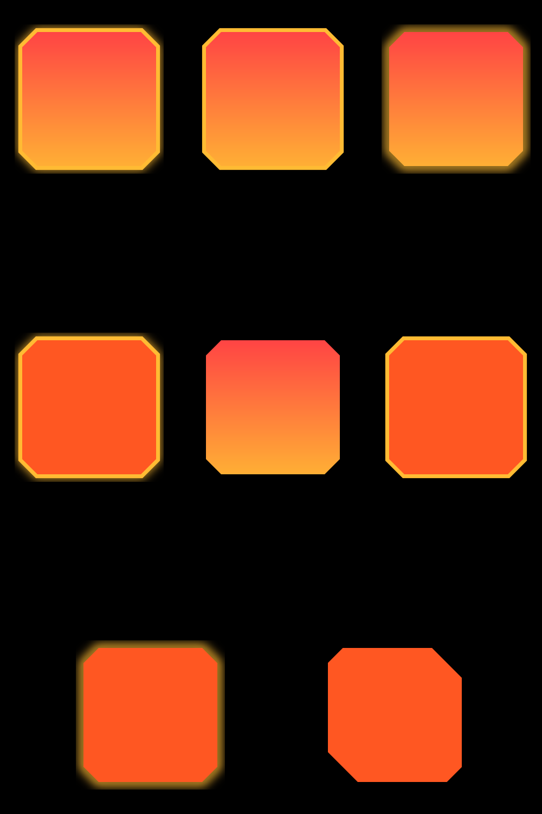
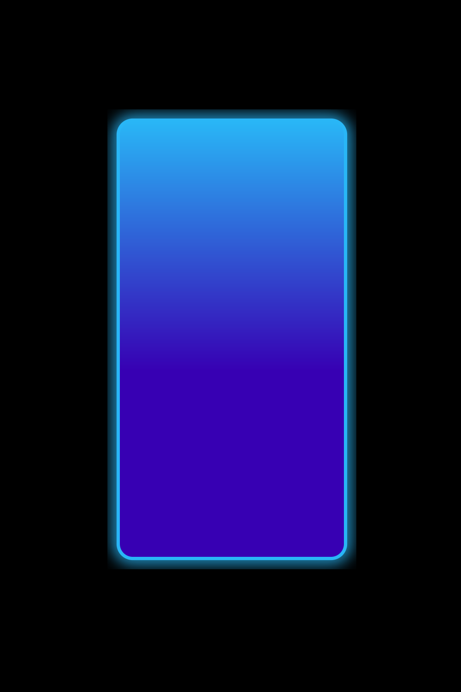
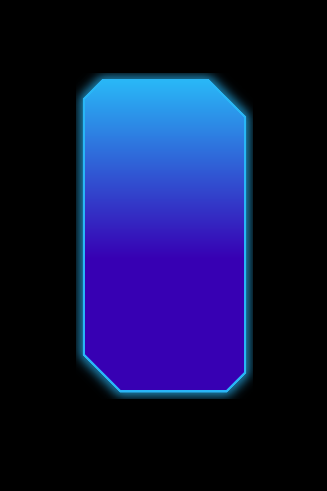

# GlowView

---
Button and layout with glow effects

## Feature

---
Base

* Round corner button
* Cut corner button
* Round corner layout
* Cut corner layout

Effect

* Glow effect
* Stroke
* Gradient background(vertical, horizontal, radial)
* Click ripple effect

## Sample

---
</img>
</img> 

</img>
</img> 

## size

---
view size = xml size(dynamic) - glow size(dynamic)

Example
* android:layout_width="100dp"
* app:gl_glowWidth="10dp"
* then, view size = 90dp

## Attribute

---

Common

| type     | name               | Description                                                        |
|----------|--------------------|--------------------------------------------------------------------|
| color    | gl_backgroundColor | Background color Gradient start color (Default colorPrimary) |
|          | gl_gradientColor   | Gradient end color (Default no color)                              |
|          | gl_strokeColor     | Stroke color (Default no color)                                    |
|          | gl_glowColor       | Glow color (Default no color)                                      |
| width    | gl_strokeWidth     | Stroke width (Default 5dp)                                         |
|          | gl_glowWidth       | Glow width (Default 5dp)                                           |
| visible  | gl_strokeVisible   | Visibility stroke (Default true)                                   |
|          | gl_glowVisible     | Visibility glow (Default true)                                     |
| Gradient | gl_gradientMode    | Gradient mode (vertical, horizontal, radial)                    |

Round corner

| type   | name            | Description                        |
|--------|-----------------|------------------------------------|
| corner | gl_cornerRadius | Round corner radius (Default 10dp) |

Cut corner

| type   | name                 | Description                             |
|--------|----------------------|-----------------------------------------|
| corner | gl_leftTopCorner     | Left top corner size (Default 10dp)     |
|        | gl_leftBottomCorner  | Left bottom corner size (Default 10dp)  |
|        | gl_rightTopCorner    | Right top corner size (Default 10dp)    |
|        | gl_rightBottomCorner | Right bottom corner size (Default 10dp) |

---

